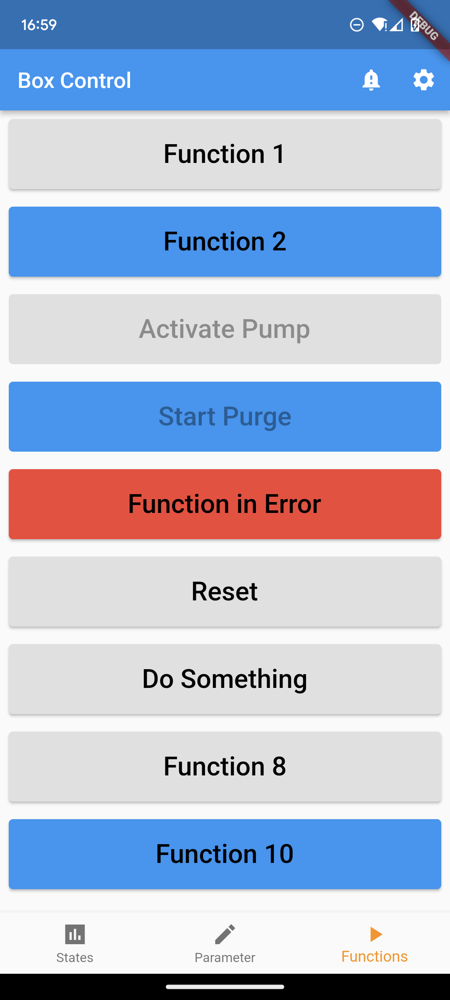

# Mobile PLC_Control

Simple flutter/dart mobile app to monitor and control a Siemens PLC via webserver. To use it, no knowledge of flutter/Dart is needed. The app can be configured via PLC.

In principle, the app consists of four views:

- Function-View: Activate/deactivate functions with button. With additional function attributes for blocked, forced or error.
- Parameter-View: Modify a parameter. Possible parameter-types are REAL, INT and BOOL.
- State-View: Monitor states. Possible state-types are REAL, INT or BOOL.
- Alarm-View: See active alarms.

Additionally, the ip-address of PLC can be set.

At the moment only working with Android Manager.

## About this project

I started this project to learn how to develope with flutter/dart. The result is an app that can be used to control and monitor a Siemens PLC via a mobile device. The goal was to make the configuration completely in the PLC, so that you can use the app without knowledge in Flutter/Dart. Knowledge of TIA Portal and programming a Siemens PLC is a prerequisite. 

I am happy to share the project. 

## Screenshots

## Functional principle

Siemens PLC must be connected to a wireless network (as for example with the help of a TP-Wireless-Link). Mobile Phone must be connected to the same network. Mobile app pulls and pushes the data via a RESTful API in the Siemens-PLC. 

## Build it up 

1. Install Android-Package (APK) in folder /apk/app-release.apk on your android mobile device.
2. Activate a webserver on your Siemens PLC and load up interfaces in folder ./plc_webserver_files to PLC. Application-Name must be localControl. Check out TIA-Portal example in ./plc_example. If you need more information regarding activation of webserver in Siemens PLC check following link: <https://johanneskinzig.de/index.php/software-development/18-restful-api-for-simatic-s7-1200-plc-python-client>
3. Connect both devices (PLC and Mobile) to same network.

## Help

If you need help or have any questions, just drop me a message. If you find bugs or have suggestions for improvement, create an issue.
